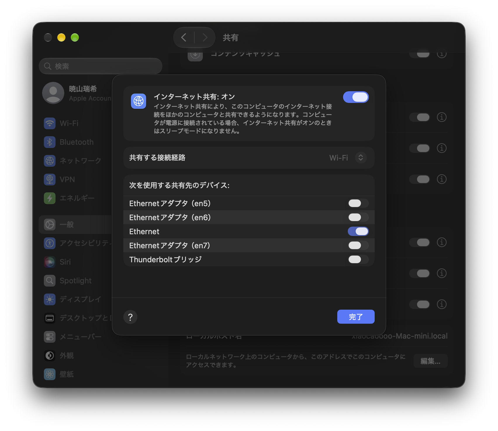

<!-- ai-summary-start -->
<details>
  <summary>AI Summary</summary>
  <div class="ai-summary-content">

* [基础系统部署]：详细记录了从引导介质启动到使用 `pacstrap` 安装核心软件包的完整流程，实现了无桌面环境的轻量化 Arch Linux 系统构建。
* [网络环境配置]：提供了多种网络接入方案，包括使用 `iwctl` 连接 Wi-Fi、通过 macOS 共享网络以及手动配置 DNS，确保安装过程中的软件包下载畅通。
* [引导与分区管理]：针对 BIOS/MBR 架构，通过 `cfdisk` 进行磁盘分区并使用 `grub-install` 配置引导程序，解决了传统引导模式下的系统启动问题。
* [系统初始化管理]：涵盖了时区同步、本地化设置、非 root 用户创建及 sudo 权限分配，完成了从 Live CD 环境到可日常维护的基础系统迁移。

  </div>
</details>
<!-- ai-summary-end -->


# 安装 Arch Linux

[Arch Linux 安装](https://wiki.archlinuxcn.org/wiki/%E5%AE%89%E8%A3%85%E6%8C%87%E5%8D%97)

> [!IMPORTANT]
> 这篇文章仅记录我的安装过程。
> 这个教程不适合日常使用，因为我没有安装桌面环境。

## 下载 Arch Linux 安装介质

[Arch Linux 安装介质](https://www.archlinux.org/download/)

> 注：启动后显示 `root@archiso: ~ #` 即为启动成功。

## 配网

> 注：有线网可跳过。可以使用 `ping -c 4 bilibili.com` 测试网络是否连接成功。

输入：

```bash
iwctl
```

会提示 `[iwd]#`。此时输入：

```bash
device list
```

能看到设备列表，通常为 `wlan0`。请根据实际设备名替换下面的 `wlan0`。

```bash
station wlan0 scan # 扫描网络
station wlan0 get-networks # 获取网络列表
station wlan0 connect <SSID> # 连接网络，<SSID> 为网络名称，不需要括号
```

提示 `Passphrase:` 时，输入密码。密码不会显示在屏幕上。

此时输入：

```bash
exit
```

退出 `iwctl`。

可以使用如下命令测试网络是否连接成功：

```bash
ping -c 4 bilibili.com
```

## 可选：使用网线直接连接 Mac mini

> 我的设备 Wi-Fi 太慢了，但是又离路由器很远。

使用网线直接连接 Mac mini 和 Arch Linux 安装设备，并且在 Mac mini 上这样设置：



在 Arch Linux 安装设备上设置网络连接。先测试有没有网络：

```bash
ping -c 4 8.8.8.8 # 如果不行还可以试试 223.5.5.5。注意：不能使用域名，因为还没有配置 DNS
```

配置 DNS：

```bash
echo "nameserver 8.8.8.8" >> /etc/resolv.conf # 如果前面没 ping 通 8.8.8.8，则使用 223.5.5.5 作为 DNS
```

## 可选：配置 sshd

> 注：这一步不是必须的，只是方便通过其他设备操作。

先设置密码：

```bash
passwd # 这里的密码只是作为 Live CD 的密码，不是最终的密码
```

启动 `sshd`：

```bash
systemctl enable --now sshd
```

查看 IP 地址：

```bash
ip addr
```

例如 `192.168.1.100`。此时可以使用其他设备通过 `ssh` 连接：

```bash
ssh root@192.168.1.100
```

## 配置时区

因为 Arch 安装会下载很多东西，所以要配置时区，否则可能会下载失败。

```bash
timedatectl set-timezone Asia/Shanghai
timedatectl
```

> 注：进入 `arch-chroot` 后 `timedatectl` 将无法使用，因为该命令依赖 `dbus` 连接。因此时区设置需要在 chroot 之前完成，或通过 `ln -sf` 方式手动配置。

## archinstall？

如果懒得设置，可以直接使用 `archinstall` 安装。详见 [关于 archinstall 的提示](https://wiki.archlinuxcn.org/wiki/%E5%AE%89%E8%A3%85%E6%8C%87%E5%8D%97#%E5%85%B3%E4%BA%8E_archinstall_%E7%9A%84%E6%8F%90%E7%A4%BA) 和 [Archinstall](https://wiki.archlinuxcn.org/wiki/Archinstall)。

## 分区

> 我这里是全盘安装。

```bash
lsblk
```

确定要分区的磁盘为 `/dev/sda`，否则请修改为对应的磁盘。

```bash
wipefs -a /dev/sda
```

> 注：`wipefs` 用于擦除设备上的文件系统签名，使分区表对系统工具不可见，并非彻底擦除磁盘数据。

运行分区工具：

```bash
cfdisk /dev/sda
```

若提示选择分区表类型，根据引导方式选择。本文使用 BIOS/MBR，因此选择 `dos`。然后：

- `[Delete]` 删除所有分区
- `[New]` 创建新分区
- `[Bootable]` 标记为引导分区
- `[Write]` 写入分区表
- 按 `q` 退出

格式化为 `ext4`：

> 我更推荐使用 `btrfs`。

```bash
mkfs.ext4 /dev/sda1
```

```bash
root@archiso ~ # lsblk
NAME   MAJ:MIN RM   SIZE RO TYPE MOUNTPOINTS
loop0    7:0    0 999.4M  1 loop /run/archiso/airootfs
sda      8:0    0 238.5G  0 disk 
└─sda1   8:1    0 238.5G  0 part 
sr0     11:0    1 622.8M  0 rom  
```

挂载分区：

```bash
mount /dev/sda1 /mnt
```

## 安装

```bash
pacstrap -K /mnt base linux linux-firmware vim sudo networkmanager wget curl
genfstab -U /mnt > /mnt/etc/fstab
arch-chroot /mnt
```

现在你就进入你的 Arch Linux 系统了 (?

```bash
[root@archiso /]#
```

```bash
ln -sf /usr/share/zoneinfo/Asia/Shanghai /etc/localtime
hwclock --systohc
```

> 注：`timedatectl` 在 chroot 环境中无法正常工作，因此进入 chroot 后应使用 `ln -sf` 方式设置时区，并用 `hwclock` 同步硬件时钟。

### 本地化

```bash
vim /etc/locale.gen
```

> [!TIP]
> 找到 `en_US.UTF-8 UTF-8` 并取消注释。也可以直接运行：
> `sed -i 's/^#en_US.UTF-8 UTF-8/en_US.UTF-8 UTF-8/' /etc/locale.gen`

```bash
locale-gen
```

创建 `/etc/locale.conf`：

```bash
echo "LANG=en_US.UTF-8" > /etc/locale.conf
```

即文件内容为 `LANG=en_US.UTF-8`。

### 设置主机名

```bash
echo "archlinux" > /etc/hostname # 注：archlinux 可以修改
```

### 设置 `root` 用户密码

```bash
passwd
```

### 安装引导程序

> 我期待的重启，结果面对我的是 `FreeDOS`。
> 当然，这是非预期的。

让我们设置 grub：

```bash
pacman -S grub
grub-install --target=i386-pc /dev/sda
grub-mkconfig -o /boot/grub/grub.cfg
```

> 注：`--target=i386-pc` 指示 `grub-install` 仅为 BIOS 系统安装，建议始终使用此选项以消除歧义。

完成后退出 chroot 并重启：

```bash
exit
umount -R /mnt
reboot
```

## 配置系统

重启后你应该就能看到 `xxx login:` 了。

这里输入 `root` 以及前面[设置的密码](#设置-root-用户密码)。

### 添加普通用户

```bash
useradd -m archie # 注：archie 可以修改
passwd archie
```

将用户加入 `wheel` 组，以便使用 `sudo`：

```bash
usermod -aG wheel archie
```

配置 `sudo`：

```bash
EDITOR=vim visudo
```

取消 `%wheel ALL=(ALL:ALL) ALL` 这一行的注释。请注意，原文件中该行的格式为 `%wheel ALL=(ALL:ALL) ALL`，取消注释即可启用。

### 启用网络管理器

安装时已经安装了 `networkmanager`，现在启用它：

```bash
systemctl enable --now NetworkManager
```

> 注：服务名称区分大小写，应为 `NetworkManager`。

如果需要 SSH 服务，可以启用：

```bash
systemctl enable --now sshd
```

现在你已经有了一个可以登录的基础 Arch Linux 系统。
